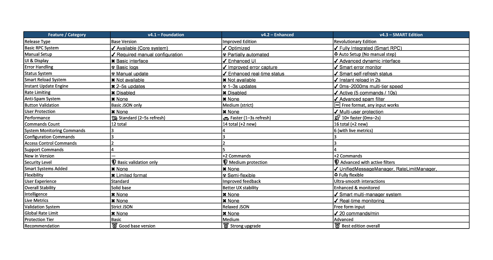

🚀 Lucifer RPC Engine v4.3 - SMART EDITION


<div align="center">
    


<br>

<div align="center">

</div>

<br>

<div align="center">

=18.0-green?style=for-the-badge&logo=nodedotjs" />


</div>

<br>

<div align="center">


</div>

<br>

<pre>
    💼 Professional Discord Rich Presence Engine
    ⚡ INSTANT UPDATES - 0ms/500ms/2000ms Smart Reload
    🔧 NO VALIDATION - Buttons Accept Any Format
    🛡️ RATE LIMITING - 5 commands/10s Protection
    🌐 Multi-Platform Support
    📱 24/7 Operation Ready
</pre>

<br>

<div align="center">

🔥 Quick Navigation

[](#-quick-start)
[](#-complete-command-reference-16-commands)
[](#-get-discord-token)
[](#-key-features)
[](#-support--troubleshooting)

</div>

<br>

<div align="center">

🔗 Connect With Me

[](https://lucifer-nukers.netlify.app)
[](https://discord.gg/NwqwbyQvZZ)
[](https://instagram.com/mr_lucifer841)
[](https://github.com/Lucifer05321)

</div>

<br>


<br>

</div>

---

## 📊 Version Comparison Chart - What's New in v4.3 🆕



---

## 🚀 Quick Start

<details>
<summary><kbd>Click to Expand - Installation Guide</kbd></summary>

### Step-by-Step Installation

```bash
# Clone the repository
git clone https://github.com/Lucifer05321/LuciferRTXrpcV4.git

# Navigate to project directory
cd LuciferRTXrpcV4

# Install dependencies
npm install

# Start the application
npm start
```

</details>

---

🔐 Get Discord Token

<details>
<summary><kbd>⚠️ TOKEN GUIDE (Important Security Information)</kbd></summary>

🎯 Recommended Method: Chrome Extension

Step 1: Install Token Extractor Extension

· Search for "Discord Token Extractor" in Chrome Web Store
· Install a reputable token extraction extension

Step 2: Get Your Token

· Open Discord Web in your browser
· Click on the extension icon
· Copy your token directly

📱 Termux Users (Android)

Step 1: Install Termux

· Download from F-Droid or GitHub Releases

Step 2: Setup Environment

```bash
pkg update && pkg upgrade -y
pkg install nodejs git -y
```

🔧 Manual Console Method (Advanced Users)

Step 1: Open Discord Web

· Go to Discord Web in your browser

Step 2: Open Developer Console

· Windows/Linux: Press Ctrl + Shift + I
· macOS: Press Cmd + Option + I
· Click on Console tab

Step 3: Execute Token Extraction

Paste this code in console:

```javascript
function getUserToken() {
    let iframe = document.createElement('iframe');
    document.body.appendChild(iframe);
    let localStorage = iframe.contentWindow.localStorage;
    
    if (!localStorage) {
        console.error('Token storage not accessible.');
        return null;
    }
    
    let token = localStorage.getItem('token');
    
    if (token) {
        console.log('User Token Retrieved:');
        console.log(token);
        return token;
    } else {
        console.error('Token not found in localStorage.');
        return null;
    }
}

getUserToken();
```

Step 4: Copy Your Token

· Copy the token that appears in console (starts with MT)
· ⚠️ Never share this token - it provides full account access
· Store it securely in the RPC configuration

🔒 Security Warning

· Your Discord token is like your account password
· Anyone with your token can access your account
· Only use this tool on your personal devices
· Never share screenshots showing your token

</details>

---

🖥️ Platform Setup Guides


<details>
<summary><kbd>Click to Expand - Windows Setup</kbd></summary>

Method 1: Standard Installation

```cmd
git clone https://github.com/Lucifer05321/LuciferRTXrpcV4.git
```

```cmd
cd LuciferRTXrpcV4
```

```cmd
npm install
```

```cmd
npm start
```

Method 2: Chocolatey Package Manager (Admin)

```cmd
@"%SystemRoot%\System32\WindowsPowerShell\v1.0\powershell.exe" -NoProfile -InputFormat None -ExecutionPolicy Bypass -Command "iex ((New-Object System.Net.WebClient).DownloadString('https://community.chocolatey.org/install.ps1'))" && SET "PATH=%PATH%;%ALLUSERSPROFILE%\chocolatey\bin"
```

```cmd
choco install nodejs git -y
```

```cmd
git clone https://github.com/Lucifer05321/LuciferRTXrpcV4.git
```

```cmd
cd LuciferRTXrpcV4
```

```cmd
npm install
```

```cmd
npm start
```

Method 3: Windows Terminal (Recommended)

· Use Windows Terminal for better experience
· Available via Microsoft Store
· Supports multiple tabs and profiles

</details>


<details>
<summary><kbd>Click to Expand - macOS Setup</kbd></summary>

Method 1: Homebrew Installation

```bash
/bin/bash -c "$(curl -fsSL https://raw.githubusercontent.com/Homebrew/install/HEAD/install.sh)"
```

```bash
brew install node git
```

```bash
git clone https://github.com/Lucifer05321/LuciferRTXrpcV4.git
```

```bash
cd LuciferRTXrpcV4
```

```bash
npm install
```

```bash
npm start
```

Method 2: Direct Installation

```bash
# Download Node.js from https://nodejs.org/
```

```bash
git clone https://github.com/Lucifer05321/LuciferRTXrpcV4.git
```

```bash
cd LuciferRTXrpcV4
```

```bash
npm install
```

```bash
npm start
```

</details>

<details>
<summary><kbd>Click to Expand - Ubuntu/Debian Setup</kbd></summary>

```bash
sudo apt update && sudo apt upgrade -y
```

```bash
sudo apt install curl git -y
```

```bash
curl -fsSL https://deb.nodesource.com/setup_18.x | sudo -E bash -
```

```bash
sudo apt-get install -y nodejs
```

```bash
git clone https://github.com/Lucifer05321/LuciferRTXrpcV4.git
```

```bash
cd LuciferRTXrpcV4
```

```bash
npm install
```

```bash
npm start
```

</details>

<details>
<summary><kbd>Click to Expand - Kali Linux Setup</kbd></summary>

```bash
sudo apt update && sudo apt full-upgrade -y
```

```bash
sudo apt install curl git build-essential -y
```

```bash
curl -fsSL https://deb.nodesource.com/setup_18.x | sudo -E bash -
```

```bash
sudo apt-get install -y nodejs
```

```bash
git clone https://github.com/Lucifer05321/LuciferRTXrpcV4.git
```

```bash
cd LuciferRTXrpcV4
```

```bash
npm install
```

```bash
npm start
```

</details>

<details>
<summary><kbd>Click to Expand - Termux Setup</kbd></summary>

Step 1: Install Termux

· Download from F-Droid or GitHub Releases

Step 2: Complete Setup Commands

```bash
pkg update && pkg upgrade -y
```

```bash
pkg install nodejs git -y
```

```bash
git clone https://github.com/Lucifer05321/LuciferRTXrpcV4.git
```

```bash
cd LuciferRTXrpcV4
```

```bash
npm install
```

```bash
npm start
```

Minimum Setup (Storage Issues)

```bash
pkg install nodejs git -y
```

```bash
git clone https://github.com/Lucifer05321/LuciferRTXrpcV4.git
```

```bash
cd LuciferRTXrpcV4
```

```bash
npm install
```

```bash
npm start
```

</details>

<details>
<summary><kbd>Click to Expand - Cloud Platforms Setup</kbd></summary>

```bash
sudo apt update && sudo apt upgrade -y
```

```bash
sudo apt install curl git -y
```

```bash
curl -fsSL https://deb.nodesource.com/setup_18.x | sudo -E bash -
```

```bash
sudo apt-get install -y nodejs
```

```bash
git clone https://github.com/Lucifer05321/LuciferRTXrpcV4.git
```

```bash
cd LuciferRTXrpcV4
```

```bash
npm install
```

```bash
nohup npm start > output.log 2>&1 &
```

Supported Platforms:

· AWS EC2
· Google Cloud
· Azure VMs
· DigitalOcean
· Heroku
· Railway

</details>

---

🎮 Complete Command Reference (16 Commands)

<details>
<summary><kbd>⚙️ System Commands (9)</kbd></summary>

status / st - System Status & Performance

```bash
status
# or
st
```

Displays complete system status with performance metrics

config / cfg - Configuration Overview

```bash
config
# or
cfg
```

Shows all configuration fields with values and status

update / up - Instant RPC Updates

```bash
update name "My RPC"
# or
up name "My RPC"
```

Modifies any RPC configuration field instantly

access / acc - User Access Control

```bash
access add @user
access remove @user
access list
# or
acc add @user
acc remove @user
acc list
```

Manages user command access control

ping / pg - Network Latency Check

```bash
ping
# or
pg
```

Checks network latency and connection quality

uptime / ut - System Uptime

```bash
uptime
# or
ut
```

Shows system uptime and resource usage

reload / rl - Instant RPC Refresh

```bash
reload
# or
rl
```

Refreshes RPC instantly

rateinfo - Rate Limit Information

```bash
rateinfo
```

Shows rate limit information

reloadstatus - Reload System Status

```bash
reloadstatus
```

Shows reload system status

</details>

<details>
<summary><kbd>🌐 Support Commands (5)</kbd></summary>

help / hlp - Command Documentation

```bash
help
# or
hlp
```

Shows complete command documentation

website - Official Website

```bash
website
```

Gets official website link

instagram - Instagram Profile

```bash
instagram
```

Gets Instagram profile link

github - GitHub Repository

```bash
github
```

Gets GitHub repository link

discord - Discord Server

```bash
discord
```

Gets Discord server link

</details>

<details>
<summary><kbd>💻 Console Only Commands (2)</kbd></summary>

clear - Clear Console

```bash
clear
```

Clears console screen for better readability

exit - Safe Shutdown

```bash
exit
```

Safely shuts down the system

</details>

---

⚡ Update Command Examples

<details>
<summary><kbd>🚀 Instant Updates (0ms)</kbd></summary>

```bash
up name "Lucifer RPC Pro"
```

```bash
up state "Coding amazing projects"
```

```bash
up details "Developing next-gen RPC systems"
```

```bash
up btn1 "Visit Website|https://lucifer-nukers.netlify.app"
```

```bash
up btn1 '{"label":"GitHub","url":"https://github.com/Lucifer05321"}'
```

```bash
up btn1 "Join Discord"
```

```bash
up btn2 "Follow Instagram|https://instagram.com/mr_lucifer841"
```

```bash
up largeTxt "Lucifer Domains"
```

```bash
up smallTxt "RPC Engine v4.3"
```

```bash
up showTime true
```

```bash
up timeZone "Asia/Kolkata"
```

</details>

<details>
<summary><kbd>⚡ Quick Updates (500ms)</kbd></summary>

```bash
up largeImg "https://cdn.discordapp.com/attachments/..."
```

```bash
up smallImg "https://cdn.discordapp.com/attachments/..."
```

```bash
up largeImg "https://lucifer-nukers.netlify.app/images/logo.png"
```

```bash
up smallImg "https://raw.githubusercontent.com/Lucifer05321/.../icon.png"
```

</details>

<details>
<summary><kbd>🔧 System Updates (2000ms)</kbd></summary>

```bash
up renewTime 24
```

```bash
up token "YOUR_NEW_DISCORD_TOKEN"
```

```bash
up clientId "123456789012345678"
```

</details>

---

🌟 Key Features

🚀 Instant Updates - Changes apply in 0ms/500ms/2000ms (10x faster than v4.1)

🔧 No Button Validation - Buttons work with JSON, pipe-separated, or plain text

🛡️ Rate Limiting - 5 commands/10s per user + 20 commands/minute global protection

⚡ Smart Reload System - Priority-based queue for multiple updates

🎨 Advanced RPC - Fully customizable Discord presence with rich media

🔄 Auto Media Renewal - Automatic image updates every 12 hours

💬 Dual Interface - Control via Discord chat or console input

🔒 Secure Storage - Encrypted configuration management

👥 Multi-User Access - Grant command permissions to trusted users

📊 Live System Stats - Real-time performance monitoring

🌙 24/7 Operation - Always online with PM2 and process management

🎯 Professional UI - Clean, modern interface with status indicators

🌐 Multi-Platform Support - Windows, macOS, Linux, Termux, Cloud platforms

🎮 16 Powerful Commands - Complete control over RPC customization

🛠️ Smart Error Handling - Automatic recovery from connection issues

🎨 Customizable Themes - Multiple appearance options

💾 Backup System - Automatic configuration backups

</div>

---

🆘 Support & Troubleshooting

<details>
<summary><kbd>🔧 Common Issues & Solutions</kbd></summary>

Check System Requirements

```bash
# Verify Node.js version
node --version

# Verify npm version
npm --version

# Check if git is installed
git --version
```

Clean Reinstallation

```bash
# Remove node_modules and reinstall
rm -rf node_modules
npm cache clean --force
npm install
```

Permission Issues (Linux/Mac)

```bash
# Fix file permissions
sudo chmod -R 755 .
sudo chown -R $USER:$USER .
```

Node.js Installation Issues

```bash
# Reinstall Node.js if commands not found
curl -fsSL https://deb.nodesource.com/setup_18.x | sudo -E bash -
sudo apt-get install -y nodejs
```

Port Already in Use

```bash
# Find and kill process using port
lsof -ti:3000 | xargs kill -9
```

Discord Token Issues

· Ensure token is copied correctly (starts with MT or mfa.)
· Token should not contain extra spaces
· Use Discord Web for most reliable token extraction

</details>

<details>
<summary><kbd>🚀 24/7 Operation with PM2</kbd></summary>

Install PM2 Process Manager

```bash
npm install -g pm2
```

Start Lucifer RPC with PM2

```bash
pm2 start npm --name "lucifer-rpc" -- start
```

Configure Auto-Start on Boot

```bash
pm2 startup
pm2 save
```

PM2 Management Commands

```bash
# View status
pm2 status

# Restart application
pm2 restart lucifer-rpc

# Stop application
pm2 stop lucifer-rpc

# View logs
pm2 logs lucifer-rpc

# Monitor performance
pm2 monit
```

Multiple Instances (Advanced)

```bash
# Start multiple instances (load balancing)
pm2 start npm --name "lucifer-rpc" -- start -i max
```

</details>

<details>
<summary><kbd>📞 Contact & Community Support</kbd></summary>

<div align="center">

🔗 Official Links & Resources

https://img.shields.io/badge/Website-Lucifer_Domains-000000?style=for-the-badge&logo=google-chrome&logoColor=white
https://img.shields.io/badge/Discord-Community_Server-5865F2?style=for-the-badge&logo=discord&logoColor=white
https://img.shields.io/badge/Instagram-Developer_Profile-E4405F?style=for-the-badge&logo=instagram&logoColor=white
https://img.shields.io/badge/GitHub-Source_Code-181717?style=for-the-badge&logo=github&logoColor=white

📥 Download Links

https://img.shields.io/badge/Termux-Android_App-00B0FF?style=for-the-badge&logo=android&logoColor=white
https://img.shields.io/badge/Node.js-Runtime_18.x-339933?style=for-the-badge&logo=nodedotjs&logoColor=white
https://img.shields.io/badge/Chrome_Extension-4285F4?style=for-the-badge&logo=google-chrome&logoColor=white

🐛 Bug Reports & Feature Requests

https://img.shields.io/badge/GitHub-Report_Issues-181717?style=for-the-badge&logo=github&logoColor=white
https://img.shields.io/badge/Discord-Get_Support-5865F2?style=for-the-badge&logo=discord&logoColor=white

</div>

Response Time Expectations

· Discord Support: 1-6 hours
· GitHub Issues: 12-24 hours
· Critical Bugs: Priority handling

Before Asking for Help

1. Check this README thoroughly
2. Look at existing GitHub issues
3. Ensure your setup meets requirements
4. Provide error logs and system info

</details>

---

<div align="center">

☕ Support This Project

If you find this project helpful and want to support continued development:


Your support helps maintain and improve this project!

</div>

---

<div align="center">

📄 License & Disclaimer

License: MIT License - See LICENSE file for complete details.

Disclaimer: This tool is developed for educational and personal use purposes only. Users are solely responsible for complying with Discord's Terms of Service and Developer Policy. The developers are not responsible for any misuse or damages caused by this software.

⚠️ Important Security Notes

· 🔒 Never share your Discord token with anyone
· 🚀 Use responsibly and respect Discord's rate limits
· 📱 Supports multiple platforms: Windows, macOS, Linux, Termux & Cloud
· 🔄 Keep updated to latest version for security patches
· 📊 Monitor usage to avoid hitting API limits

🎯 Recommended Usage

· Personal profile customization
· Developer testing environments
· Educational projects
· Non-commercial applications

<br>

Made with ❤️ by Lucifer


</div>

---

<div align="center">

⭐ If you find this project helpful, please give it a star on GitHub!

https://api.star-history.com/svg?repos=Lucifer05321/LuciferRTXrpcV4&type=Date

https://img.shields.io/badge/⭐_Give_Star-181717?style=for-the-badge&logo=github&logoColor=white

</div>
